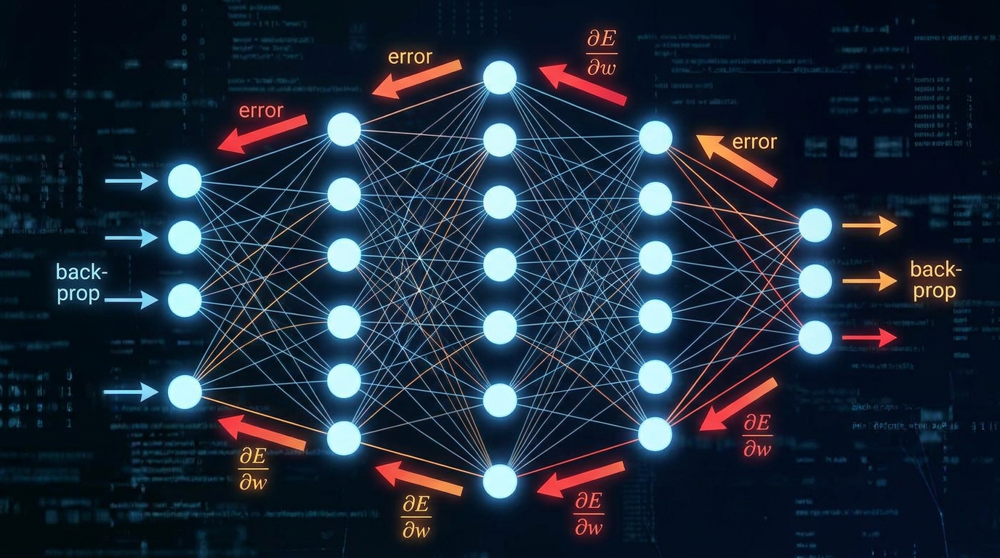

<p align="center">
  
</p>

<h1 align="center">Backprop from scratch</h1>

<p align="center">
  <strong>Build a neural network with nothing but numpy, and write every gradient yourself.</strong>
</p>

<p align="center">
  
  
  
  
</p>

<p align="center">
  <a href="#getting-started">Getting started</a>
  &nbsp;·&nbsp;
  <a href="#the-route">The route</a>
  &nbsp;·&nbsp;
  <a href="#how-the-checker-helps">How the checker helps</a>
  &nbsp;·&nbsp;
  <a href="lessons/00-start-here.md">First lesson</a>
</p>

<br>

> During an interview I was asked: *you are given an MLP with 50 layers. What's the input of the 25th layer during a backward pass?*

If you are preparing a technical interview and this question sounds impossible to answer, you are in the right place. Here, you will have the possibility to have a solid and real understanding of backprop, and by the end you will realize how easy that question really was. The idea is simple: learn by doing. Apply theory to code and understand backprop for real.

How? With a very simple challenge: your task is to **implement an MLP of three layers using only numpy.**

This could sound hard to tackle, but that's why this repo is here for you: you will be guided through the process. Each step starts with the theory, then you write one function whose signature, shapes and docstring are already there. A checker tells you, in plain words, what's right and what isn't.

<br>

## Getting started

You need [uv](https://docs.astral.sh/uv/getting-started/installation/). It installs Python and numpy for you on the first run.

```bash
git clone https://github.com/albertobarnabo/backprop-from-scratch.git
cd backprop-from-scratch
uv run tour.py
```

Then open **[lessons/00-start-here.md](lessons/00-start-here.md)**.

> [!TIP]
> Read the lessons rendered, on GitHub or in your editor's Markdown preview, so the math displays and the hints stay folded.

<details>
<summary><strong>Without uv</strong></summary>
<br>

Python 3.12+ and numpy are all you need. In a virtual environment:

```bash
python3 -m venv .venv
source .venv/bin/activate        # on Windows: .venv\Scripts\activate
pip install numpy pytest
python tour.py
```

</details>

## How it works

Every step is the same loop:

1. **Read** the lesson: the theory, the shapes to aim for, and hints if you're stuck.
2. **Write** one function in `backprop/`, replacing its `raise NotImplementedError(...)`.
3. **Run** `uv run tour.py`: it checks your work, shows your progress, and tells you what to fix.

You can also check a single step with `uv run tour.py 4`, or run every check at once with `uv run pytest`.

## The route

Nine functions in `backprop/`, all empty when you start, in the order the code is written:

| Step | You write | In | Lesson |
|:---:|---|---|---|
| 1 | `Linear.forward` | `layers.py` | [The linear layer](lessons/01-linear-forward.md) |
| 2 | `Linear.backward` | `layers.py` | [Backprop through a layer](lessons/02-linear-backward.md) |
| 3 | `Sigmoid.forward` | `layers.py` | [The sigmoid](lessons/03-sigmoid-forward.md) |
| 4 | `Sigmoid.backward` | `layers.py` | [The sigmoid's derivative](lessons/04-sigmoid-backward.md) |
| 5 | `MSE.forward` | `losses.py` | [The cost](lessons/05-mse-forward.md) |
| 6 | `MSE.backward` | `losses.py` | [Where backprop starts](lessons/06-mse-backward.md) |
| 7 | `Sequential.forward` | `network.py` | [Chaining layers](lessons/07-sequential-forward.md) |
| 8 | `Sequential.backward` | `network.py` | [Backprop through the network](lessons/08-sequential-backward.md) |
| 9 | `Sequential.step` | `network.py` | [Gradient descent](lessons/09-sequential-step.md) |
| 10 | nothing: watch it learn | `train_xor.py` | [Train it on XOR](lessons/10-train-xor.md) |

## How the checker helps

**It tests the math, not a memorised answer.** To check a gradient, it nudges every number by a tiny amount and measures how the cost moves. If that matches your gradient, your calculus is right.

**Shapes are spelled out.** The checks use `batch_size=5`, `n_in=3`, `n_out=4` (and `hidden=6` for the small networks). When something has shape `(4, 5)` instead of `(5, 4)`, you're told, and you know exactly which dims are swapped.

**Common mistakes get named.** Averaging instead of summing, a missing bias, a forgotten factor of 2, a flipped sign, layers in the wrong order, an array changed in place by accident: the checker recognises them and says so.

**numpy errors get translated.** A cryptic `matmul: Input operand 1 has a mismatch in its core dimension 0` becomes the line of your code where it happened, and what to look at.

**Your prints don't get in the way.** Anything your code prints during a check is shown only if that check fails, trimmed to the first lines.

## Rules of the game

| | |
|---|---|
| **numpy only** | The point is to see every gradient. |
| **Keep the signatures** | The checks rely on them, and they're designed to point you the right way. |
| **Hints come last** | They're behind a click. Try without them first: the struggle is where the learning happens. |

## Companion notes

[`Backprop.pdf`](Backprop.pdf) is the set of handwritten notes this course grew out of: the chain rule for one neuron, then for many. The lessons point to them where they help.
