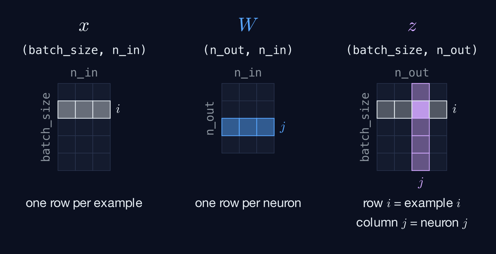

# Step 1: `Linear.__init__` and `Linear.forward`

> **Write:** `Linear.__init__` and `Linear.forward` in `backprop/layers.py`
>
> **Notes:** page 1 ($z^{(L)}$) and page 3 ($w_{jk}$)

## Theory

### One neuron

A neuron takes the activation of the previous layer, scales it by a weight, and adds a bias:

$$z^{(L)} = w^{(L)} a^{(L-1)} + b^{(L)}$$

### A layer of neurons

With several neurons on both sides, every neuron $j$ of this layer is connected to every neuron $k$ of the previous one, each connection with its own weight $w_{jk}$:

$$z_j = w_{j0} a_0 + w_{j1} a_1 + w_{j2} a_2 + b_j = \sum_k w_{jk} a_k + b_j$$

Put all the weights in a matrix `W`, with `W[j, k]` $= w_{jk}$. Row $j$ holds all the weights going **into** neuron $j$, so `W` is `(n_out, n_in)`. Computing every $z_j$ at once for one example is a matrix–vector product:

$$z = W a + b$$


### Where the weights start

Before any learning, the weights need a value. The obvious choice, all zeros, is a trap: if every weight of a layer starts equal, every neuron computes the same $z$, receives the same gradient, gets the same update, and stays identical to its neighbours forever. The layer would be as good as a single neuron. Starting from **random** values breaks that symmetry. The biases can start at zero: the random weights are already enough to make the neurons different.


How random? $z_j$ is a sum of `n_in` terms, so the more inputs, the bigger it gets. If $z$ is large, the sigmoid that comes next sits on its flat parts, where its slope is almost 0, and learning crawls. A common choice is to draw the weights from a normal distribution and scale them by $\frac{1}{\sqrt{n_{in}}}$, which keeps $z$ of the order of 1.

The layer receives a random number generator, `rng`, so that the same seed always builds the same network: experiments are reproducible, and the checks can rebuild your layers exactly.

### A batch of examples

We don't feed one example at a time: `x` holds `batch_size` examples, one per **row**, so it's `(batch_size, n_in)`. You want the same thing for every row: row $i$ of the result is $W x_i + b$, the $z$ of example $i$. So the result is `(batch_size, n_out)`: one row per example, one column per neuron.



Careful: $W a$ is written for one example as a column vector. Your examples are **rows**. Same math, but the shapes have to be arranged differently.

## Your task

Write `Linear.__init__` and `Linear.forward`. The parameters must be called `W` and `b`, the rest of the code looks for them. Everything else is up to you.

Questions to ask yourself:

- What shape do `W` and `b` need, and where do their starting values come from?
- What can `rng` be when nobody passes one?
- Look at page 1 of the notes: $\frac{\partial z}{\partial w} = a^{(L-1)}$. Step 2 will need that. Will it still be around when backward runs?

## Shapes

| | Shape |
|---|---|
| `x` (in) | `(batch_size, n_in)` |
| `W` | `(n_out, n_in)` |
| `b` | `(n_out,)` |
| `z` (out) | `(batch_size, n_out)` |

## Hints

<details>
<summary>Hint 1: random numbers</summary>

A numpy generator has methods like `rng.standard_normal(shape)` or `rng.uniform(low, high, shape)`, which return an array of the given shape. `np.random.default_rng()` makes a new generator.

</details>

<details>
<summary>Hint 2: start from the shapes</summary>

You need to turn `(batch_size, n_in)` into `(batch_size, n_out)`. With `@`, the inner dims must match and disappear: `(a, k) @ (k, b)` → `(a, b)`. So `x` must be multiplied by something shaped `(n_in, n_out)`. What do you have that can be shaped like that?

</details>

<details>
<summary>Hint 3: the bias</summary>

After the product you have `(batch_size, n_out)` and `b` is `(n_out,)`. A plain `+` adds `b` to every row: that's exactly "every example gets the same bias".

</details>

## Check

```bash
uv run tour.py
```

Next: [step 2, `Linear.backward`](02-linear-backward.md).
