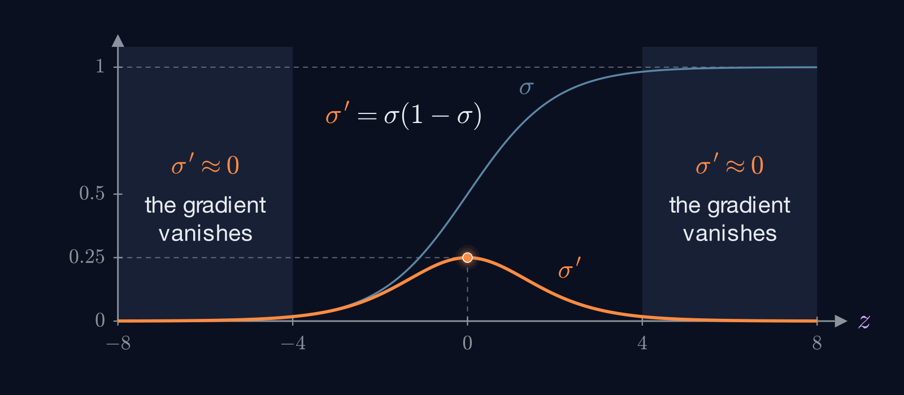

# Step 4: `Sigmoid.backward`

> **Write:** `Sigmoid.backward` in `backprop/layers.py`
>
> **Notes:** page 1, where $\frac{\partial a^{(L)}}{\partial z^{(L)}} = \sigma'(z^{(L)})$

## Theory

### The derivative of the sigmoid

$$\sigma(z) = \left(1 + e^{-z}\right)^{-1}$$

$$\sigma'(z) = \frac{e^{-z}}{\left(1 + e^{-z}\right)^2} = \underbrace{\frac{1}{1 + e^{-z}}}_{\sigma(z)} \cdot \underbrace{\frac{e^{-z}}{1 + e^{-z}}}_{1 - \sigma(z)}$$

So:

$$\sigma'(z) = \sigma(z) \big(1 - \sigma(z)\big)$$

The derivative only needs $\sigma(z)$, which forward already computed.



### The chain rule, one neuron at a time

`grad_out` is $\frac{\partial C}{\partial a}$, how the cost reacts to this layer's output. You want $\frac{\partial C}{\partial z}$, how it reacts to the input. From the notes:

$$\frac{\partial C}{\partial z_j} = \frac{\partial a_j}{\partial z_j} \cdot \frac{\partial C}{\partial a_j} = \sigma'(z_j) \cdot \frac{\partial C}{\partial a_j}$$

Compare with the input gradient of `Linear`: there, $a_k$ fed **every** neuron, so you had to sum over all of them. Here $a_j$ depends **only on $z_j$**. One path, no sum, no matrix product: every entry is multiplied by its own $\sigma'$, independently of the others.

## Your task

Write `Sigmoid.backward`, which returns $\frac{\partial C}{\partial z}$.

Questions to ask yourself:

- Where does $\sigma(z)$ come from, now that forward has returned?
- If forward didn't keep anything, what would you have to change in step 3?

## Shapes

| | Shape |
|---|---|
| `grad_out` (in) | same as the output of forward |
| returned $\frac{\partial C}{\partial z}$ | same as `grad_out` |

## Hints

<details>
<summary>Hint 1</summary>

Every array here has the same shape, and every entry is handled on its own: you only need element-wise operations (`*`, `-`). `@` would mix the neurons together, which is wrong here.

</details>

<details>
<summary>Hint 2</summary>

If you kept $\sigma(z)$ from forward, it already **is** $\sigma(z)$. Don't apply the sigmoid to it again.

</details>

## Check

```bash
uv run tour.py
```

That's `layers.py` done. Next: [step 5, `MSE.forward`](05-mse-forward.md).
